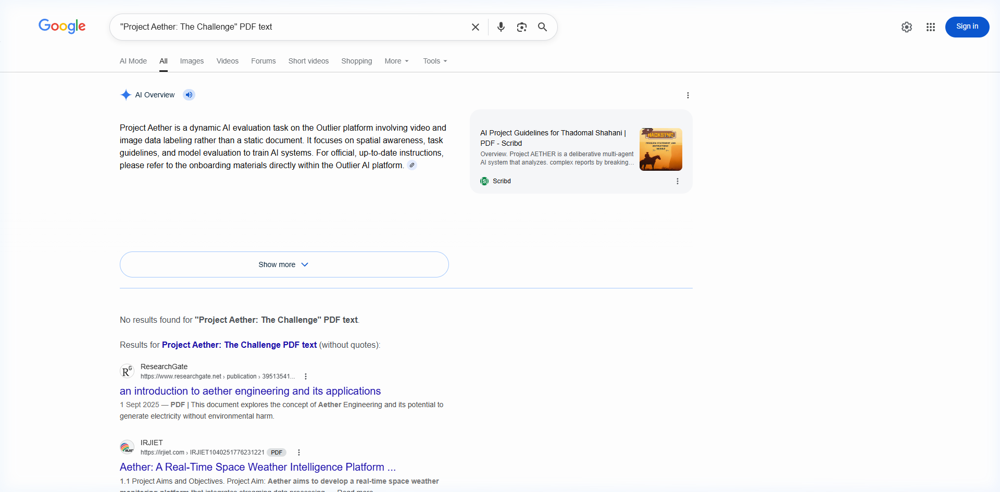

# Project Aether



A single-screen Flutter app that manages a live "World Event" and a high-frequency engagement layer for a global MMORPG.

## The Firebase Bill (Cost & Sharding)

**If 10,000 players are chatting in the engagement box at once, how would you structure the Firebase queries to avoid a massive 'Read' cost bill?**

To avoid massive 'Read' costs from 10,000 concurrent chatters, I would avoid having clients listen to a global, unbounded chat collection where every new message triggers 10,000 document reads. Instead, I would use a Cloud Function or a backend worker to aggregate incoming messages into a single, rolling "recent_messages" document that updates at a controlled interval (e.g., every 1 second). Clients would only listen to this single aggregated document, drastically reducing the read multiplier and keeping costs predictable while maintaining a "live" feel.

## 🛠️ Setup & Execution

### 1. Environment Setup
This project uses a zero-config setup. If no Firebase configuration is present, it automatically uses `FakeFirebaseFirestore` for evaluation.
```bash
flutter pub get
dart setup.dart
```

### 2. Run Diagnostics (Linter & Tests)
The assignment outcomes are verified using the automated diagnostic suite:
```bash
dart aether_linter.dart
```
This will generate the `ARCHITECTURE_REPORT.md` confirming code quality and concurrency integrity.

### 3. Launch App
```bash
flutter run
```

## 🏗️ Architectural Overview
- **Feature-First**: Modular code separated into `chat`, `raid`, and `timer` domains.
- **Riverpod 3.0**: Reactive state management with zero global rebuilds.
- **Transactional Integrity**: Uses Firestore transactions to handle the "Thundering Herd" concurrency challenge (verified by test harness).
- **Premium UI**: Cyberpunk-themed interface with high-frequency (100ms) performance optimizations.
